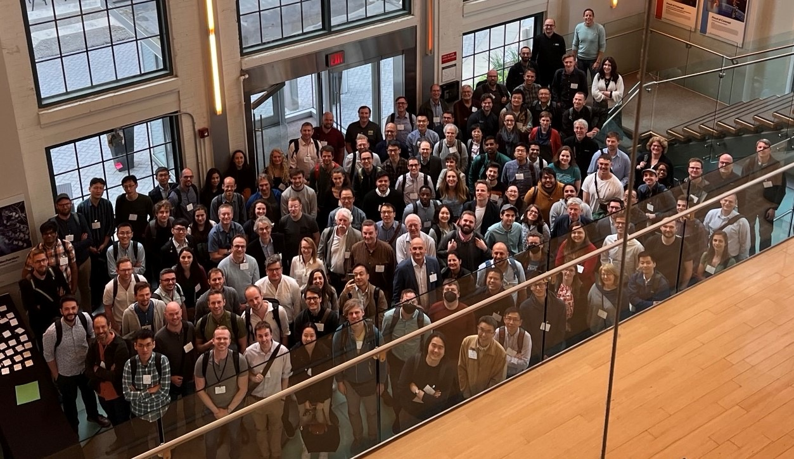

# Description
The 2023 Workshop on Free Energy Methods in Drug Design, which took place from May 10-12, 2023, at the Novartis Institutes for BioMedical Research in Cambridge, MA, brought together experts from both the pharmaceutical industry and academia. The workshop's objective was to discuss challenges and future directions for free energy techniques in drug design. The workshop was
organized in partnership with  Boston Area Group for Informatics and Modeling (BAGIM).
## Group Photo

# Organization Committee
* [Hannah Bruce Macdonald, PhD](https://www.linkedin.com/in/hannah-bruce-macdonald-b820a776/)
* [Sereina Riniker, PhD](https://www.linkedin.com/in/sereina-riniker-99a4473a/)
* [Zoe Cournia, PhD](https://www.linkedin.com/in/zoecournia/)
* [Kira A. Armacost, PhD](https://scholar.google.com/citations?user=mdIiZ7AAAAAJ&hl=en)

# Keynote Speaker: Derek Lowe
* **Institution**: Director in Chemical Biology Therapeutics at Novartis Institutes for BioMedical Research (NIBR); Blogger
* **Trade Blog**: [In The Pipeline](https://www.science.org/blogs/pipeline)
* **Title**: "FEP and Drug Discovery: Where We've Been and Where We'd Like to Go"

 <iframe width="560" 
         height="315" 
         src="https://www.youtube.com/embed/HSh4AzzhGKM?si=UUYPT8S7j25MNXDz"
         title="YouTube video player" 
         frameborder="0" 
         allow="accelerometer; autoplay; clipboard-write; encrypted-media; gyroscope; picture-in-picture" 
         allowfullscreen>
 </iframe>

# Schedule
## May 10th, 2023 (Day 1)

| Time (EST)     | Speaker                | Title       |
|----------------|------------------------|------------------------------------|
| 8:45           | **ARRIVAL**            | |
| 9:00           | Jose Duca              | Welcome to NIBR  |
| 9:05           | Kira + Hannah          | Opening remarks  |
|                | Session Chair          | David Huggins    |
| 9:10           | Michael Shirts         | Free energies: What we’ve learned about how to estimate them          |
| 9:35           | Sereina Riniker        | 10+ Years with (RE-)EDS: Efficient Free-Energy Calculations with a Multistate Method |
| 10:00          | Huafeng Xu             | Adaptive optimization of binding free energy networks and integration of experimental data |
| 10:25          | **BREAK**              | |
| **Session Chair: Rafal Wiewiora**       | | |
| 10:40          | Bill Jorgensen         | Free Energy Calculations from Butane to COVID-19                       |
| 11:05          | Jonathan Essex         | Enhancing protein and ligand sampling in molecular simulations by fully adaptive simulated tempering |
| 11:30          | Derek Lowe (KEYNOTE)   | FEP and Drug Discovery: Where We've Been and Where We'd Like to Go    |
| 12:15          | **LUNCH**              | | 
| 1:30           | Zoe Cournia            | Welcome back |
| **Session Chair: Matthew Hurley**       | | |
| 1:35           | Jonah Vilseck          | Rapid and Accurate Free Energies of Binding from λ-Dynamics with Bias Updated Gibbs Sampling |
| 2:00           | David Mobley           | Separated Topologies: A flexible approach for relative binding free energy calculations |
| 2:25           | Christopher Bayly      | Making Binding Free Energies Practical in a Massively Parallel Universe |
| 2:50           | **BREAK**              | |
| **Session Chair: Ernest Awoonor-Williams**  | | |
| 3:05           | Ana Silveira           | On the use of high-throughput binding free energy simulations in design cycles for drug discovery |
| 3:30           | Katharina Meier        | Free Energy Calculations in Pharmaceutical and Crop Science R&D at Bayer |
| 3:55           | **POSTER SESSION**     | |       

## May 11th, 2023 (Day 2)

| Time (EST)     | Speaker                | Title       |
|----------------|------------------------|------------------------------------|
| 9:00           | Sereina + Camilo       | Welcome + Opening remarks    |
| **Session Chair: Yutong Zhao**          | | |
| 9:10           | Chia-en Chang          | Ligand Binding Kinetics: Pathways, Transient States and Unbinding Free Energy Profile |
| 9:35           | Alex Dickson           | Learning and sampling complex ligand binding pathways with weighted ensemble techniques |
| 10:00          | Josh Fass              | A local resampling trick for focused molecular dynamics |
| 10:25          | **BREAK**              | |
| **Session Chair: Phillip Hudson**       | | |
| 10:40          | Robert Abel            | Accelerating drug discovery with ultra-large scale collaborative deployment of predictive modeling |
| 11:05          | Marco De Vivo          | Pushing the boundaries: FEP for protein-protein and protein-nucleic acids interaction |
| 11:30          | Xin (Cindy) Yan        | Promises and Limitations: Free Energy Methods in Drug Discovery Projects |
| 11:55          | **LUNCH**              | |
| **Session Chair: Antonia Mey**          | | |
| 1:15           | Zoe Cournia            | Welcome back + Poster prize announcement |
| 1:20           | Julien Michel          | Engineering FEP science in the open |
| 1:45           | Jay Ponder             | Accuracy of the AMOEBA Force Field in Binding Free Energy Simulations |
| 2:10           | Lance M. Westerhoff    | Fast, absolute binding free energy calculations using MovableType: the impact of different global sampling regimes on predictive performance |
| 2:35           | **BREAK**              | |
| **Session Chair: Zoe Cournia**          | | | 
| 2:50           | Emilio Galliachio      | AToM-OpenMM: An Open-Source Software Package for Relative Binding Free Energy Estimation in Drug Discovery |
| 3:15           | Francesca Deflorian    | Expanding the Realm of FEP and GPCR Drug Design |
| 3:40           | John Chodera           | Teaching free energy calculations to learn |
| 4:05           | **BREAK**              | |
| **Session Chair: Ryan Hayes**           | | |
| 4:25           | Gianni De Fabritiis    | Relative binding affinity calculations towards accuracy and scalability |
| 4:50           | Lingle Wang            | Beyond Small Molecule Binding: Free Energy Calculations for Antibody Affinity, pH Sensing, Small Molecule Solubility and More |
| 5:15           | David Hahn             | Impacting drug discovery with open source free energy calculation tools |

## May 12th, 2023 (Day 3)

| Time (EST)     | Speaker                | Title       |
|----------------|------------------------|------------------------------------|
| 9:00           | Kira + Jonah           | Welcome + Opening remarks |
| **Session Chair: Jonah Vilseck**        | | |
| 9:10           | Darrin York            | Enhancing Precision and Accuracy in Alchemical Free Energy Simulations |
| 9:35           | David Pearlman         | Free Energy Perturbation calculations incorporating a quantum representation of the ligand binding site |
| 10:00          | Mark Mackey            | Improving efficiency of free energy calculations with adaptive lambda schedules |
| 10:25          | **BREAK**              | |
| **Session Chair: Sepehr Dehghanighahnaviyeh**  | | |
| 10:40          | Hugo Gutierrez de Teran | QFEP: combining ligand SAR and in silico mutagenesis for ligand design |
| 11:05          | Andrey Frolov          | Dealing with high flexibility of crosslinked peptides in FEP calculation |
| 11:30          | **ROUND TABLE DISCUSSION** | |
| 11:55          | **LUNCH**              | |
| **Session Chair: Alisha Caliman**       | | |
| 1:15           | Zoe Cournia            | Welcome back  |
| 1:20           | Michael Schnieders     | An Alchemical Pipeline for Polymorph Discovery and Optimization        |
| 1:45           | David Minh             | Binding pose prediction using absolute binding free energy calculations |
| 2:10           | Lucy Colwell           | Machine learning to predict protein function from sequence with therapeutic applications |
| 2:35           | Kira + Hannah          | Closing remarks     

# We Thank Our Corporate Sponsors
* [Novartis](http://www.novartis.com)
* [Schrödinger Inc.](http://www.schrodinger.com)
* [Alkermes](https://www.alkermes.com)
* [Acellera](https://www.acellera.com)
* [AstraZeneca](https://www.astrazeneca.com)
* [BIOVIA](https://www.3ds.com/products/biovia)
* [Chemical Computing Group](https://www.chemcomp.com)
* [Cresset Group](https://cresset-group.com)
* [Lilly](https://www.lilly.com)
* [Pfizer](https://www.pfizer.com)
* [PlayMolecule](https://open.playmolecule.org)
* [QuantumBio](https://www.quantumbioinc.com)
* [Boehringer Ingelheim](https://www.boehringer-ingelheim.com)
* [Psivant](http://www.psivant.com)
* [Sossei Heptares](https://soseiheptares.com)
* [Biogen](https://www.biogen.com)
* [JCIM](https://pubs.acs.org/journal/jcisd8)
* [OpenBioSim](https://www.openbiosim.org)