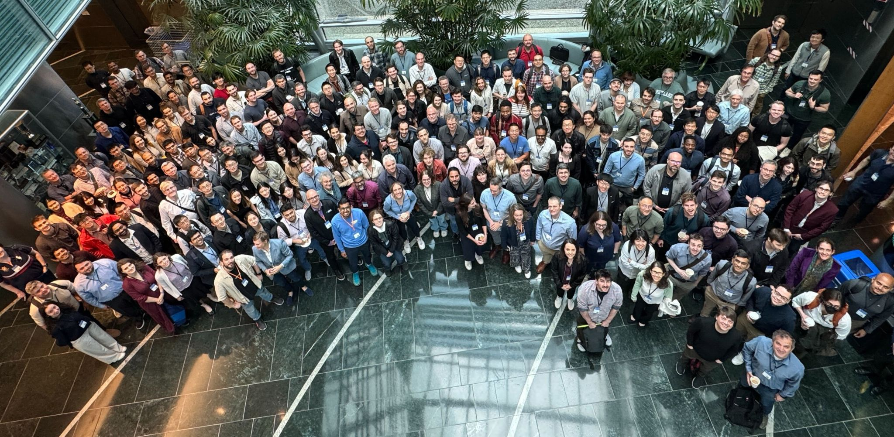
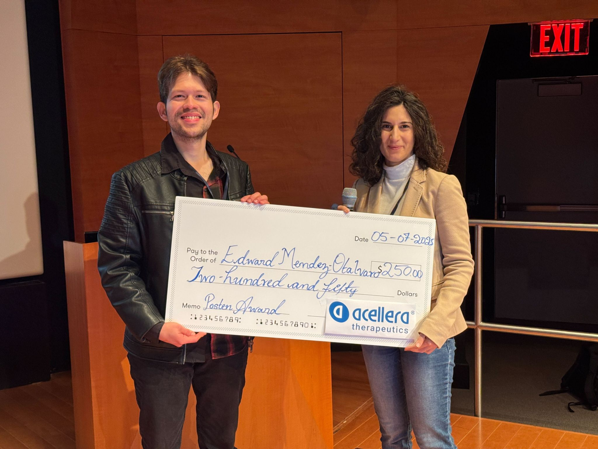
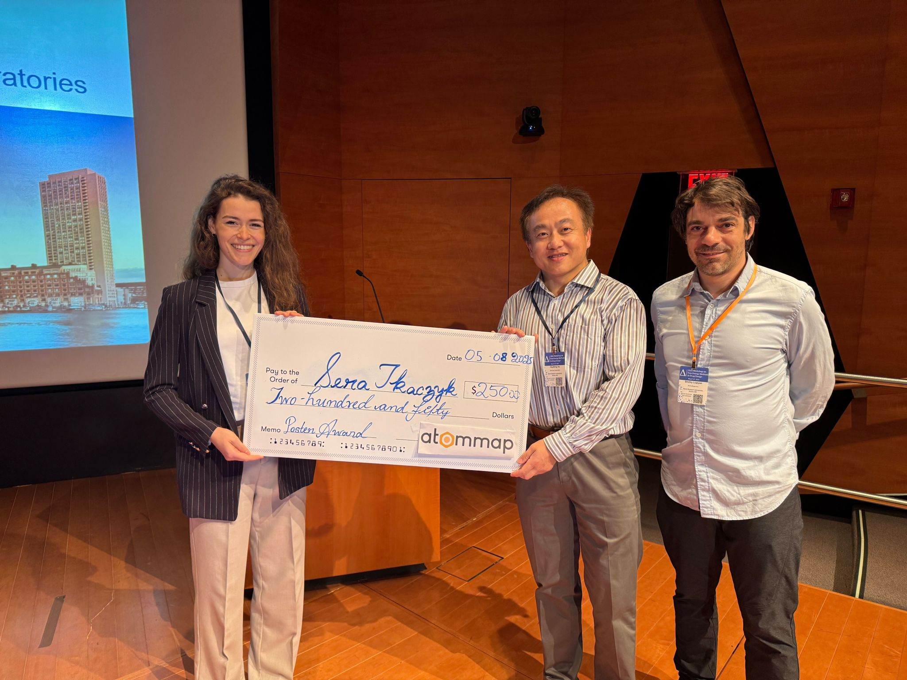

# Description
The 2025 Free Energy Workshop, hosted by the Alchemistry Organization Committee and the OMSF, took place from May 6-8th at the Merck Research Laboratories in Boston, Massachusetts. The workshop focuses on free energy methods in computational chemistry and drug design and welcomed around 240 researchers from around the globe.
## Group Photo

# Organization Committee
* [Jonah Vilseck, PhD](https://medicine.iu.edu/faculty/44747/vilseck-jonah)
* [Heidi Koldsø, PhD ](https://www.linkedin.com/in/heidi-kolds%C3%B8-935b9729/)
* [George Giambasu, PhD](https://www.linkedin.com/in/giambasu/)
* [Cesar Mendoza Martinez, PhD](https://www.linkedin.com/in/cesar-mendoza-martinez-0411b3b4/)
* [Dmitry Lupyan, PhD](https://www.linkedin.com/in/dmitry-lupyan-9980468/)
* [Aakankschit Nandkeolyar (AK)](https://www.linkedin.com/in/aakankschit-nandkeolyar-838b0b126/)
* [Cristian Gabellini](https://www.linkedin.com/in/cristian-gabellini/)
* [Zachary J. Baker](https://www.linkedin.com/in/zachary-j-baker/)
* [Alexander Williams, PhD](https://www.linkedin.com/in/ahwchemistry/)
## Organizer's Photo

# Keynote Speaker 1
Dennis Hu
**Institution**: Chief Executive Officer, Drug Hunter
**Title**: "Not Your Grandparents' Drugs: Modern Highlights in Small Molecule Drug Discovery"
**Video**: YouTube

---
# Keynote Speaker 2
Rommie E. Amaro

**Institution**: Professor and Endowed Chair of Chemistry and Biochemistry and the Director of the National Biomedical Computation Resource at University of California, San Diego
**Title**: 
**Video**: YouTube

# Schedule
## May 6th, 2025 (Day 1)
| Time           | Speaker           | Title |
|----------------|-------------------|------------------------------------------------------------------------------------------------------------------------------------------|
| 8:00 - 8:40    |                   | Venue opens; Set up posters for evening poster session; continental breakfast |
| 8:40 - 9:00    | George Giambasu   | Welcome + Opening Remarks |
| 9:00 - 9:25    | David Mobley      | Binding free energy calculations with separated topologies -- successes and challenges |
| 9:25 - 9:50    | Junjie Zou        | XFF: Development and benchmarking of small molecule force field and its applications in binding free energy predictions |
| 9:50 - 10:15   | Emilio Gallicchio | The Alchemical Transfer Method: Theory, Methods, and Applications |
| 10:15 - 10:35  |                   | Break |
| 10:35 - 11:00  | Barbara Farkas    | Revisiting fragment screening campaigns through the eye of absolute binding FEP |
| 11:00 - 11:25  | Daniel Cole       | A transferable double exponential force field for condensed phase simulations |
| 11:25 - 11:50  | Vytautas Gapsys   | ABFE pitfalls in virtual screening |
| 11:50 - 1:10   |                   | Lunch |
| 1:10 - 2:00    | Dennis Hu         | Keynote Speaker #1: Not Your Grandparents' Drugs: Modern Highlights in Small Molecule Drug Discovery |
| 2:00 - 2:25    | Matthew Segall    | Physical Model Induction with QuanSA: Affinity Prediction that is Synergistic with Simulation-Based Methods |
| 2:25 - 2:50    | Ara Abramyan      | Accurate Physics-Based Prediction of Binding Affinities of RNA- and DNA-Targeting Ligands |
| 2:50 - 3:10    |                   | Break |
| 3:10 - 3:35    | Jonathan Essex    | Grand Canonical Nonequilibrium Candidate Monte Carlo for In Silico Prediction of Fragment Binding Sites, Modes, and Affinities |
| 3:35 - 4:00    | Hannah Baumann    | The Alchemist's toolbox: Expanding the domain of applicability of the OpenFE ecosystem |
| 4:00 - 4:30    |                   | 1-min Poster Flash Talks |
| 4:30 - 6:00    |                   | Poster Session 1 - Sponsored by JCIM |
| 6:00 - 6:30    |                   | Travel to evening social |
| 6:30 -         |                   | Social Hosted by Schrödinger |

## May 7th, 2025 (Day 2)
| Time           | Speaker                        | Title |
|----------------|-------------------------------|-----------------------------------------------------------------------------------------------------------------------------------------------------------------------------------------------------------------------------------------------------------------------------------------------------------------------------------|
| 8:00 - 8:30    |                               | Venue opens; Set up posters for evening poster session; continental breakfast |
| 8:30 - 8:35    |                               | Opening Announcements; poster prizes |
|                | Session Chair                 | Cesar Mendoza-Martinez |
| 8:35 - 9:00    | John Chodera                  | Teaching free energy calculations to learn |
| 9:00 - 9:25    | Michael Shirts                | Playing Mr. Potato Head with Free Energy Methods: Alchemical Metadynamics, Replica Exchange of Expanded Ensembles (REXEE), and Multi-Topology Replica Exchange of Expanded Enseble (MT-REXEE) |
| 9:25 - 9:50    | Finlay Clark                  | Robust Automated Truncation Point Selection for Molecular Simulations |
| 9:50 - 10:15   | Michael Liesen                | Implementing Ligand Overlay in λ-Dynamics with Bias-Updated Gibbs Sampling (LaDyBUGS) as an Alternative Topology Model for Free Energy Calculations |
| 10:15 - 10:35  |                               | Break |
|                | Session Chair                 | Cristian Gabellini |
| 10:35 - 11:00  | Anupam Ojha                   | End-to-end automated simulation pipeline with machine-learned force fields for accelerated drug-target kinetic and thermodynamic predictions |
| 11:00 - 11:25  | William (Zhiyi) Wu            | Target deconvolution with ABFE calculations |
| 11:25 - 11:50  | Gianni De Fabritiis           | Accurate Relative Binding Free Energy Calculations Using AceForce 1.0 |
| 11:50 - 1:10   |                               | Lunch |
|                | Session Chair                 | Jonah Vilseck |
| 1:10 - 2:00    | Rommie Amaro                  | Keynote Speaker #2: Multiscale Computational Microscopy |
| 2:00 - 2:25    | Shams Mehdi                   | AI-augmented Molecular Dynamics for Drug Dissociation Kinetics and Interpretable Insights into Drug-Target Interactions |
| 2:25 - 2:50    | Natasja Brooijmans            | Drugging the undruggable using covalency and computationally-driven design |
| 2:50 - 3:10    |                               | Break + Group Photo |
|                | Session Chair                 | Dima Lupyan |
| 3:10 - 3:35    | Abba Leffler                  | Exploiting solvent exposed salt-bridge interactions for the discovery of potent inhibitors of SOS1 using free-energy perturbation simulations |
| 3:35 - 4:00    | Olivia Pierce                 | Computational Modeling of Heterobifunctional Degraders of Catalytically Inactive Interleukin Receptor Associated Kinase 3 (IRAK3) |
| 4:00 - 4:25    | Steven Albanese               | Free Energy Calculations for ADMET Liabilities: A Cyp2D6 case study |
| 4:25 - 4:50    | Shi Zhang                     | Advanced alchemical free energy methods for drug discovery in AMBER/AMBER Drug Discovery Boost |
| 5:00 - 6:30    |                               | Poster Session 2 - Sponsored by JCTC |

## May 8th, 2025 (Day 3)
| Time           | Speaker                | Title |
|----------------|------------------------|------------------------------------------------------------------------------------------------------------------------------------------|
| 8:00 - 8:30    |                        | Venue opens; continental breakfast |
| 8:30 - 8:35    |                        | Opening Announcements; poster prizes |
|                | Session Chair          | Amirmasoud Samadi |
| 8:35 - 9:00    | Lingle Wang            | Free Energy Calculations to Advance Drug Discovery: Small Molecules, Peptides, and Biologics |
| 9:00 - 9:25    | Stefan Boresch         | Direct free energy simulations with neural network potentials |
| 9:25 - 9:50    | Sirish Kaushik Lakkaraju| MDFit+: Integrating machine-learning & molecular simulations to predict ligand potency |
| 9:50 - 10:15   | Xinqiang Ding          | Improve Free Energy Estimate for Free |
| 10:15 - 10:35  |                        | Break |
|                | Session Chair          | Michael Liesen |
| 10:35 - 11:00  | Huafeng Xu             | Free energy calculations in the discovery and optimization of targeted protein degraders |
| 11:00 - 11:25  | Niels Kristian Madsen  | Residence-time scoring for high-throughput computer-aided drug design |
| 11:25 - 11:50  | Abir Ganguly           | Accurate binding affinity predictions for protein-peptide systems using physics-based methods. |
| 11:50 - 12:00  |                        | Closing Remarks |

# Poster Session Winners
* [Edward Francisco Mendez-Otalvaro](https://www.linkedin.com/in/edward-francisco-mendez-otalvaro-12171732/), "Tuning the Affinity of Potential Activators for a K2P Channel."

* [Sara Tkaczyk](https://www.linkedin.com/in/sara-tkaczyk-69404935a/), "Alchemical Free Energy Calculations with Neural Network Potentials."

# We Thank Our Corporate Sponsors
* [Schrödinger Inc.](http://www.schrodinger.com)
* [Tandem AI](https://tandemai.com)
* [SandboxAQ](https://www.sandboxaq.com)
* [Atommap](https://www.atommap.com)
* [Astex Pharmaceuticals](https://astx.com)
* [Janssen](https://www.jnj.com)
* [Bristol Myers Squibb](https://www.bms.com)
* [VeraChem](https://www.verachem.com)
* [Kvantify](https://www.kvantify.com/)
* [Boehringer Ingelheim](https://www.boehringer-ingelheim.com)
* [Cresset](https://cresset-group.com)
* [OpenBioSim](https://www.openbiosim.org)
* [DeepOrigin](https://www.deeporigin.com)
* [Chemical Computing Group](https://www.chemcomp.com)
* [Vilya](https://vilyatx.com)
* [Achira](https://achira.ai)
* [QuantumBio](https://www.quantumbioinc.com)
* [Acellera](https://www.acellera.com/)
* [JCTC](https://pubs.acs.org/journal/jctcce)
* [JCIM](https://pubs.acs.org/journal/jcisd8)

# We Thank Our Venue Host
* [Merck Research Laboratories](https://www.merck.com/research/)